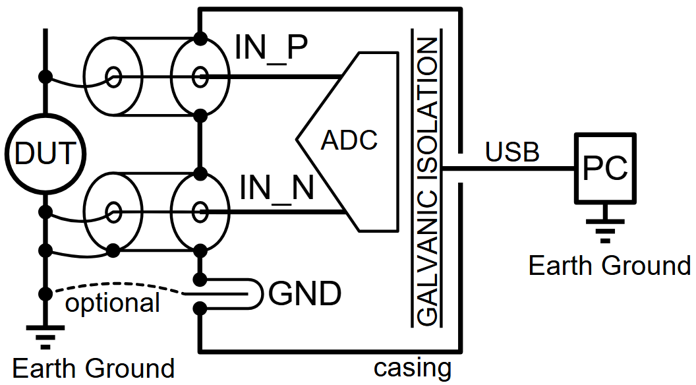
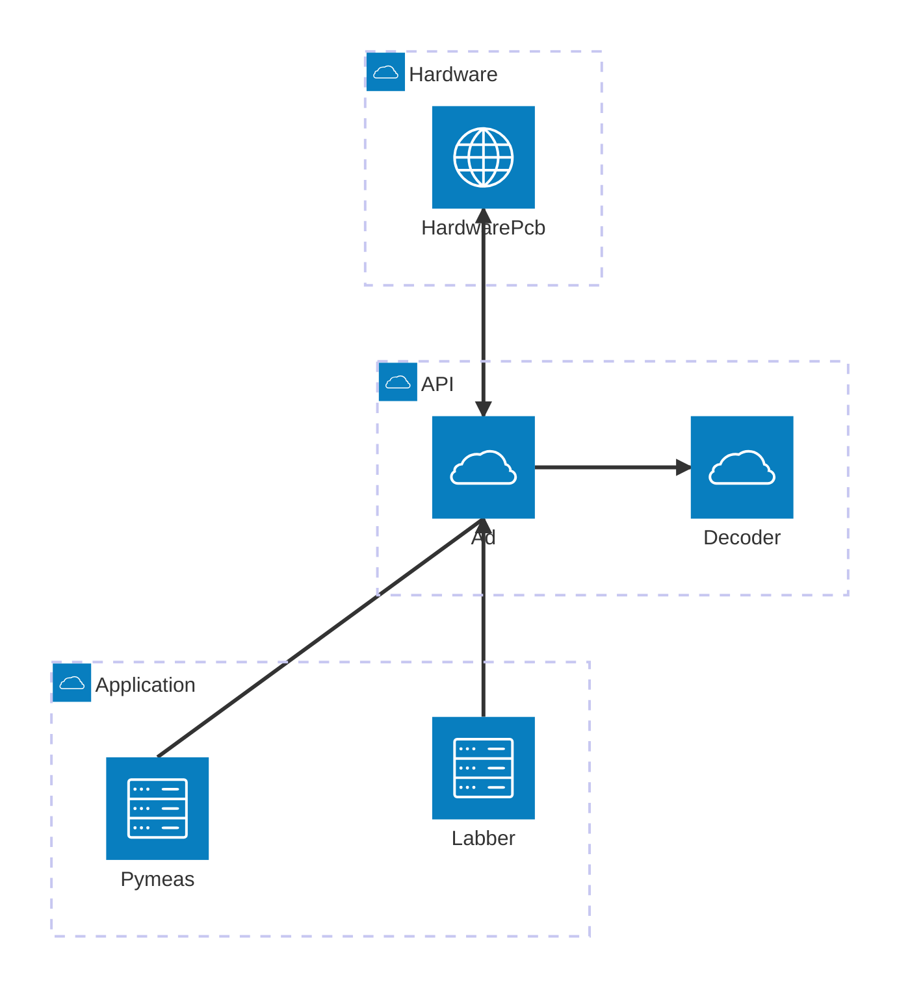

# ad_low_noise_float_2023_git

Ad converter hardware connecting to USB. Used to measure low frequency noise.

* [Instructions (PDF)](instructions/20250919b_instructions_ad_low_noise_float_2023.pdf)
* [Labber Driver (git repo)](https://github.com/nanophysics/labber_ad_low_noise_float_2023)

## Relations between the different software packags

* PCB: The hardware (PCB)
  * https://github.com/petermaerki/ad_low_noise_float_2023_git
  * Directory `hardware` KiCad
  * Directory `software/pico` C++

* Decoder: python package: The protocol decoder written in C++/pybind11
  * https://github.com/petermaerki/ad_low_noise_float_2023_git
  * Directory `software/decoder`

* Ad: python package: The logic to communicate with the PCB
  * https://github.com/petermaerki/ad_low_noise_float_2023_git
  * Directory `src/ad_low_noise_float_2023`

* Labber: The Labber driver written in python
  * https://github.com/nanophysics/labber_ad_low_noise_float_2023

* Pymeas: python application
  * https://github.com/nanophysics/pymeas2019_noise
