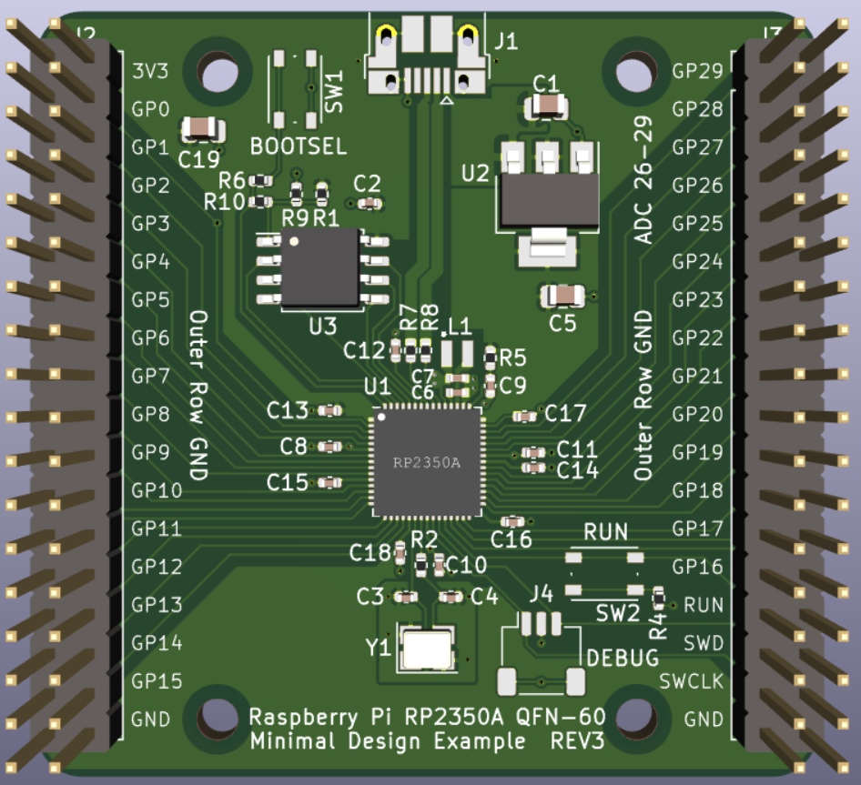

# Reference PCB for rp2350

## Links

* https://datasheets.raspberrypi.com/rp2350/hardware-design-with-rp2350.pdf

* https://oshwlab.com/lckfb-team/coloreasypicox

## https://datasheets.raspberrypi.com/rp2350/Minimal-KiCAD.zip

* positive: RP2350A
* positive: SWD Connector
* posttive: Minimal - lots of space
* negative: No JLCPCB

Links:

  * https://github.com/arturo182/rp2350_minimal_kicad

## https://github.com/solderparty/rp2350_stamp_xl_hw

* negative: RP2350B
* positive: seems serious, compact
* negative: Not JLCPCB
* negative: XL
* negative: SWD connector

## https://github.com/solderparty/rp2350_stamp_hw

* positive: RP2350A
* positive: seems serious, compact
* negative: Not JLCPCB
* negative: No SWD connector

## https://github.com/red-scorp/RP2350-ProMini

* positive: seems serious, compact
* postive: JLCPCB
* negative: JTAC special connector

## https://github.com/funvill/RP2350A_Minimal_USBC

* **JLCPCB partnumbers on README**
* postive: JLCPCB
* postive: QFN-60
* negative: Not tested yet